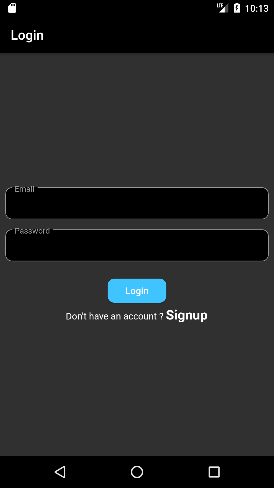
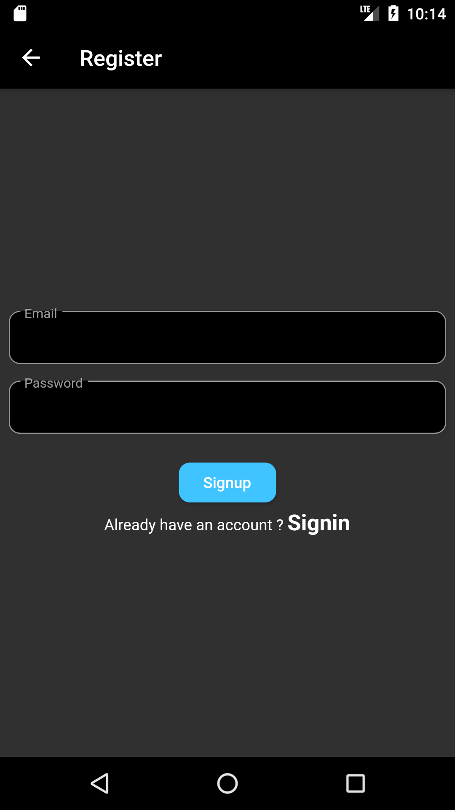
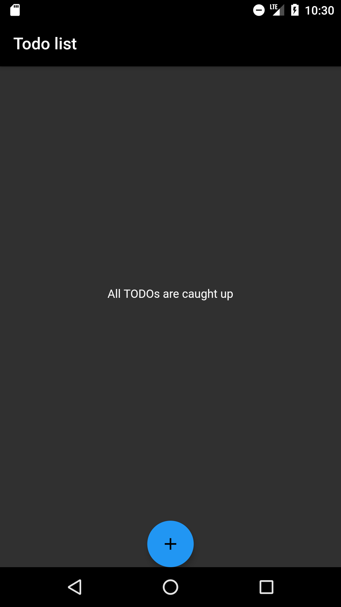
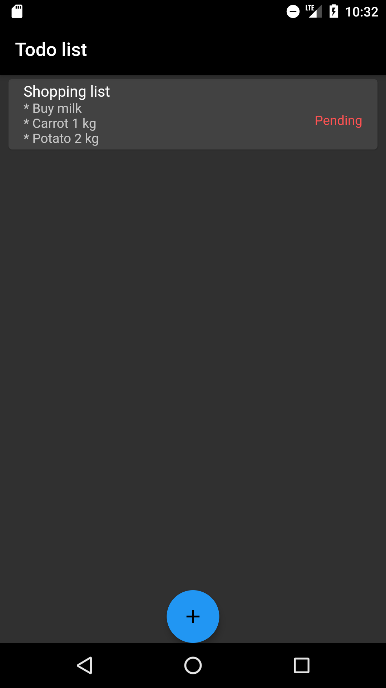
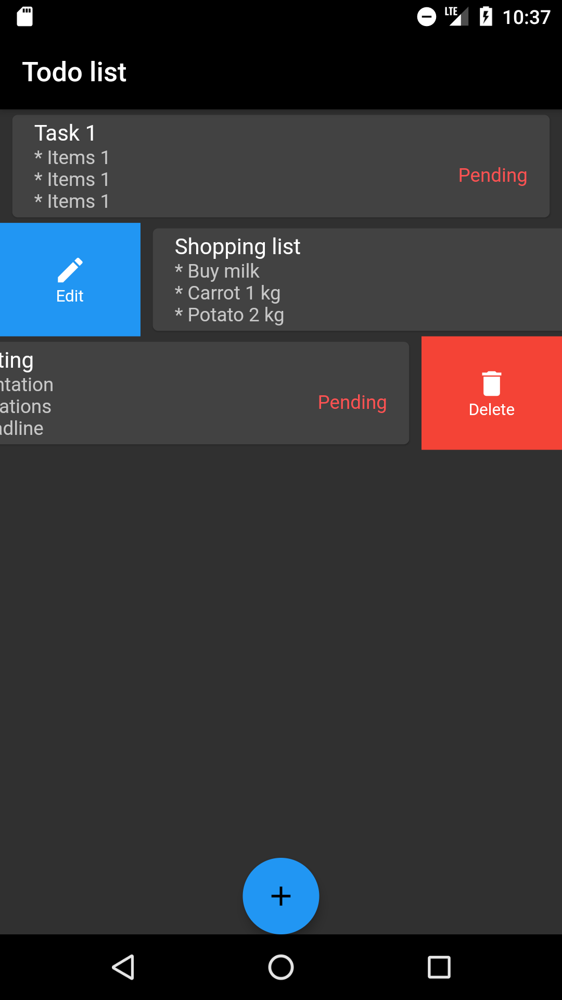
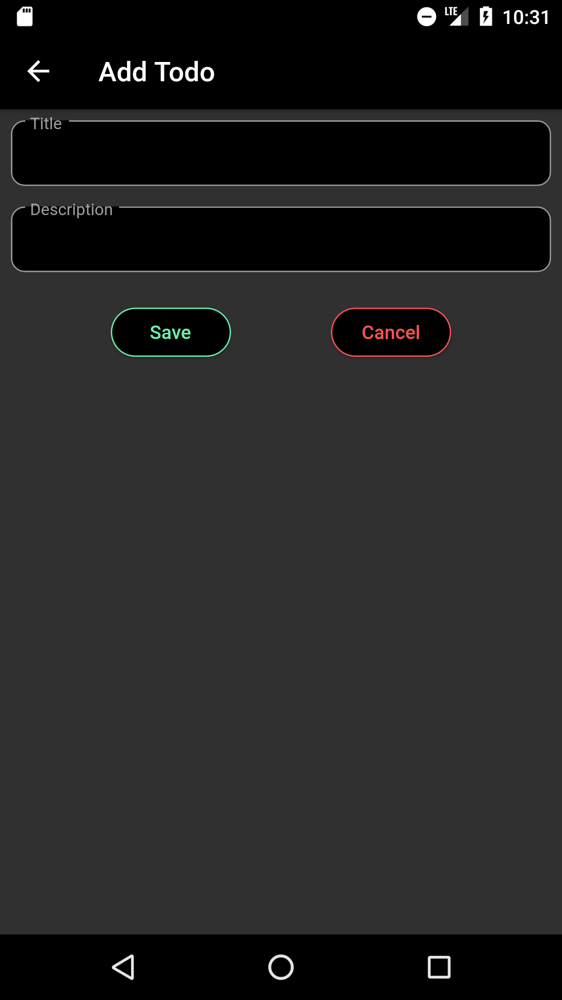
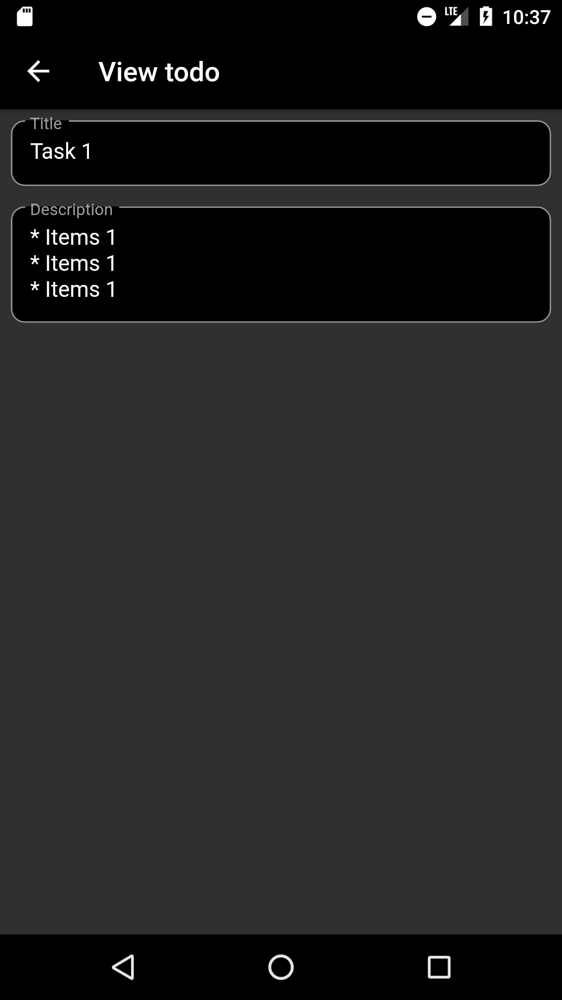
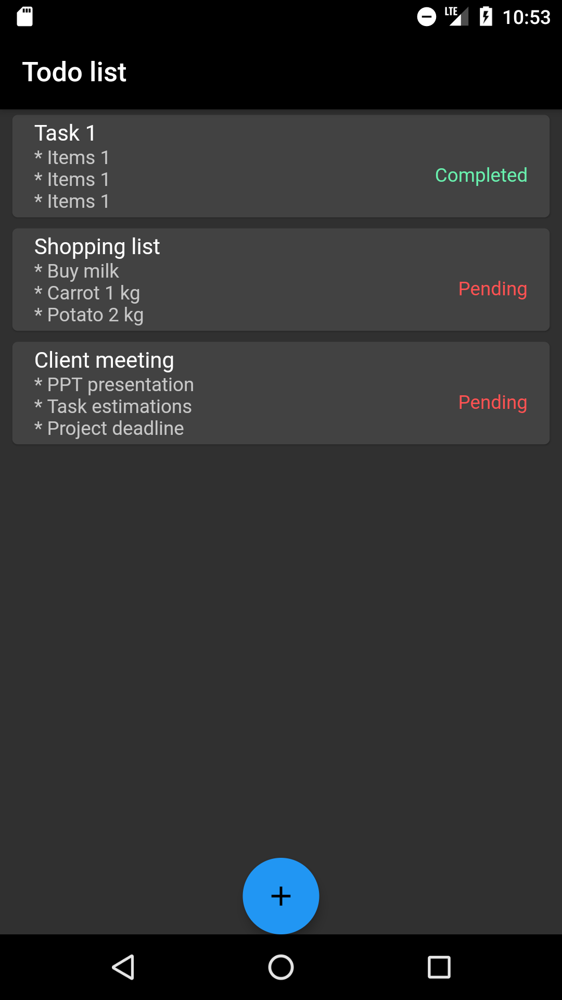

#  Todo application

In progress classic Todo application using flutter with firebase as the backend

### Firebase Authentication

    * Signin feature
    * Signup feature
    * Sign-out feature
    * Email verification

### Firebase Firestore

    * Read data
    * Write data
    * Update data
    * Delete data

### App screens

| Login                   | Register                      |
| ----------------------- | ----------------------------- |
|  |  |

| Empty Todo List                             | Todo List                       | Delete and Edit options                                    |
| ------------------------------------------- | ------------------------------- | ---------------------------------------------------------- |
|  |  |  |

| Add Todo                      | View Todo                       | 
| ----------------------------- | ------------------------------- |
|  |  |

| Todo List Status              |
| ----------------------------- |
|  |"# 200100140_IntroToAppDev_assignmennt_4" 
